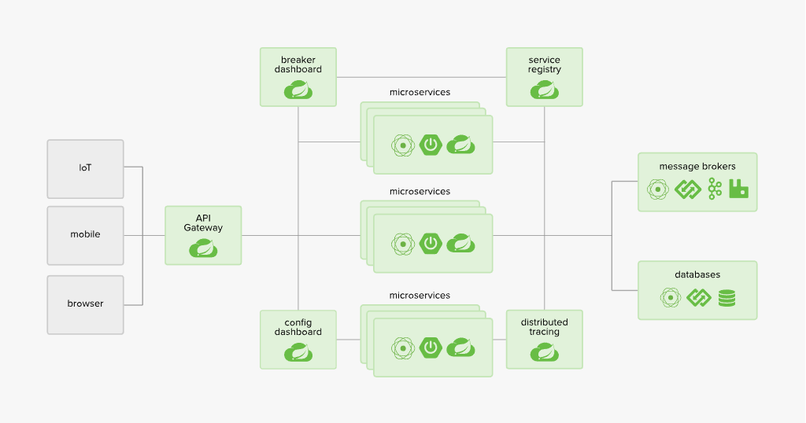
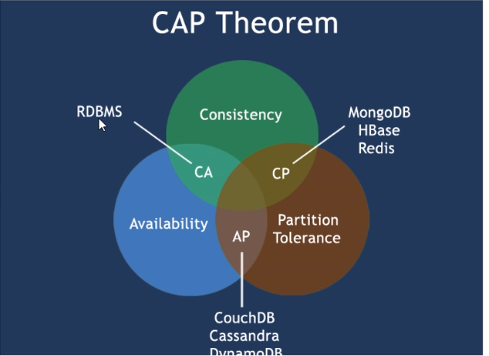
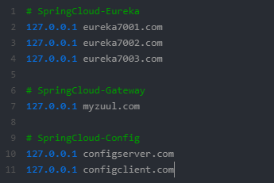
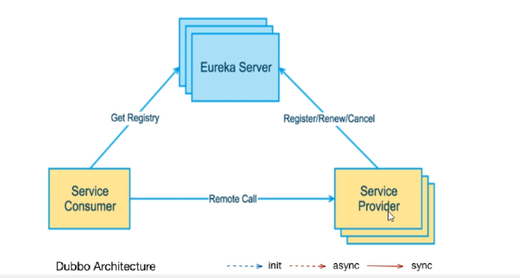

# Spring Cloud学习项目

## 欢迎star，以兹鼓励哟（^V^）

- 项目是基于[gongxings/spring-cloud-study](https://github.com/gongxings/spring-cloud-study)项目，在自己的理解的基础上又写了一遍



## 项目版本(比较老的版本了)

- spring cloud版本：Dalston.SR1
- spring boot版本：1.5.19.RELEASE

## 项目模块说明

``` lua
scs
├── scs-api -- 构建公共子模块 + Hystrix服务降级
├── scs-config-3344 -- 配置中心服务端 
├── scs-config-client-3355 -- 配置中心客户端 
├── scs-config-dept-client-基于配置中心的服务提供者
├── scs-config-eureka-client-7001 -- 基于配置中心的Eureka
├── scs-consumer-dept-80 -- 构建服务消费者
├── scs-consumer-dept-feign -- 构建服务消费者
├── scs-consumer-hystrix-dashboard -- Hystrix调用监控 
├── scs-eureka-7001 -- Eureka集群
├── scs-eureka-7002 -- Eureka集群
├── scs-eureka-7003 -- Eureka集群
├── scs-provider-dept-8001 -- 构建服务提供者集群
├── scs-provider-dept-8002 -- 构建服务提供者集群
├── scs-provider-dept-8003 -- 构建服务提供者集群
├── scs-provider-dept-hystrix-8001 -- Hystrix服务熔断
└── scs-zuul-gateway-9527 -- Zuul路由网关 
```
## CAP理论



## Hosts映射修改



## 项目启动

1. 启动eureka-service端集群：
   - [scs-eureka-7001](https://github.com/voishion/scs/tree/master/scs-eureka-7001)
   - [scs-eureka-7001](https://github.com/voishion/scs/tree/master/scs-eureka-7002)
   - [scs-eureka-7001](https://github.com/voishion/scs/tree/master/scs-eureka-7003)
   
   
   
2. 启动微服务提供者集群：
   - [scs-provider-dept-8001 (连01数据库)](https://github.com/voishion/scs/tree/master/scs-provider-dept-8001)
   - [scs-provider-dept-8001 (连02数据库)](https://github.com/voishion/scs/tree/master/scs-provider-dept-8001)
   - [scs-provider-dept-8001 (连03数据库)](https://github.com/voishion/scs/tree/master/scs-provider-dept-8001)
   
3. 启动为服务消费者：
   > 以下两者二选一启动，它两主要区别（具体见笔记中第四小节）是：<br/>
   > dept-80：Ribbon+RestTemplate 调用Rest服务<br/>
   > dept-feign：Feign+接口 调用Rest服务（优雅简单）
   - [scs-consumer-dept-80 (含Ribbon客户端负载均衡)](https://github.com/voishion/scs/tree/master/scs-consumer-dept-80)
   - [scs-consumer-dept-feign (含Feign负载均衡、Hystrix服务降级)](https://github.com/voishion/scs/tree/master/scs-consumer-dept-feign)
   
4. Hystrix 服务熔断、降级、监控   
   > 服务熔断：<br/>
   > 	缺点就是每一个方法对应都得写一个fallBackMethod方法，代码膨胀，所以我们之后看服务降级(*^__^*)<br/>
   >     主要在单个服务出异常的时候用<br/>
   > 
   > 服务降级：<br/>
   > 	统一处理主业务与熔断方法解耦，是在客户端（消费者）处理完成的，与服务端没关系<br/>
   >     主要在单个服务整个被关闭的时候用
   - [scs-provider-dept-hystrix-8001 (Hystrix服务熔断)](https://github.com/voishion/scs/tree/master/scs-provider-dept-hystrix-8001)
   - [scs-api (Hystrix服务降级)](https://github.com/voishion/scs/tree/master/scs-api)
   - [scs-consumer-hystrix-dashboard (Hystrix调用监控)](https://github.com/voishion/scs/tree/master/scs-consumer-hystrix-dashboard)
   
5. Zuul 路由网关
   
   - [scs-zuul-gateway-9527 (Zuul路由网关)](https://github.com/voishion/scs/tree/master/scs-zuul-gateway-9527)
   
6. Config 分布式配置中心
   - [scs-config-3344 (config服务端)](https://github.com/voishion/scs/tree/master/scs-config-3344)
   - [scs-config-client-3355 (config客户端)](https://github.com/voishion/scs/tree/master/scs-config-client-3355)
   
7. 基于Config 分布式配置中心的服务提供者以及eureka注册中心
   - [scs-config-eureka-client-7001 (eureka注册中心)](https://github.com/voishion/scs/tree/master/scs-config-eureka-client-7001)
   - [scs-config-dept-client-8001 (服务提供者)](https://github.com/voishion/scs/tree/master/scs-config-dept-client-8001)
